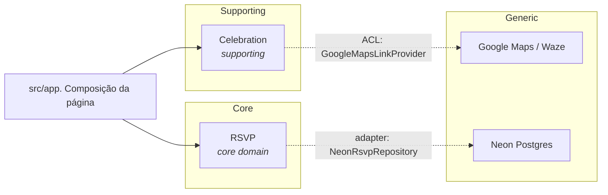
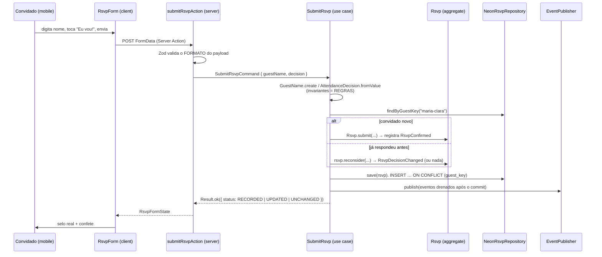

# Arquitetura. Convite dos 2 anos da Ivy

> Documento vivo. Se o código divergir daqui, um dos dois está errado. Conserte o que for mais barato e registre a decisão em um [ADR](./adr).

## 1. Por que DDD em um convite de aniversário?

Honestidade primeiro: um convite de festa **não precisa** de DDD. O sistema tem
duas telas e uma tabela.

O objetivo aqui é outro: usar um escopo pequeno e real para exercitar os
conceitos **à risca**, com um custo de erro baixo. Toda a estrutura abaixo é
defensável em revisão de código. Nenhuma peça existe "porque DDD manda". Onde
o padrão canônico seria excessivo, a decisão de simplificar está registrada num
ADR em vez de acontecer no silêncio.

O que isso compra de verdade, mesmo neste tamanho:

- as regras de convidado (nome válido, resposta única por pessoa, idempotência)
  são testáveis em milissegundos, sem banco e sem navegador;
- trocar Neon por qualquer outra coisa é reescrever 2 arquivos;
- a UI pode ser refeita do zero sem tocar em uma linha de regra.

## 2. Design estratégico

### 2.1 Domínio e subdomínios

| Subdomínio                | Tipo         | Por quê                                                                                                                  |
| ------------------------- | ------------ | ------------------------------------------------------------------------------------------------------------------------ |
| **RSVP**                  | _Core_       | É a razão do site existir. Toda a complexidade real (identidade do convidado, idempotência, mudança de ideia) vive aqui. |
| **Celebration**           | _Supporting_ | Dados da festa. Necessário, mas sem regra interessante: hoje é um arquivo de config.                                     |
| Hospedagem, e-mail, mapas | _Generic_    | Compra-se pronto (Vercel, Neon, Google Maps). Nunca implementamos.                                                       |

### 2.2 Context Map



**Relações:**

- **RSVP ↔ Celebration: `Separate Ways`.** Os dois contextos não se conhecem.
  Não há import cruzado, não há chave estrangeira, não há evento entre eles. A
  integração acontece um nível acima, em `src/app/page.tsx`, que compõe duas
  leituras independentes numa página. Isso é verificado pelo ESLint
  (`ddd/context-isolation`).
- **Celebration → Google Maps: `Anti-Corruption Layer`.** O domínio conhece
  endereço e coordenada; que exista uma empresa chamada Google é detalhe do
  adapter `GoogleMapsLinkProvider`.

### 2.3 Ubiquitous Language

O idioma do código do domínio é **inglês** (decisão do time. Ver
[ADR-0010](./adr/0010-ubiquitous-language-em-ingles.md)), com o glossário
PT-BR ↔ EN mantido em [`ubiquitous-language.md`](./ubiquitous-language.md).
Mensagens voltadas ao convidado são em português, porque o convidado é o leitor.

## 3. Design tático

### 3.1 Building blocks em uso

| Bloco               | Onde                                                                                                                 |
| ------------------- | -------------------------------------------------------------------------------------------------------------------- |
| Aggregate Root      | `Rsvp`, `Celebration`                                                                                                |
| Entity              | via `Entity<TId>` no Shared Kernel                                                                                   |
| Value Object        | `GuestName`, `GuestKey`, `AttendanceDecision`, `RsvpId`, `Venue`, `GeoCoordinates`, `CelebrationSchedule`, `Honoree` |
| Domain Event        | `RsvpConfirmed`, `RsvpDeclined`, `RsvpDecisionChanged`                                                               |
| Repository (Port)   | `RsvpRepository`, `CelebrationRepository`                                                                            |
| Application Service | `SubmitRsvp` (command), `GetCelebrationDetails` (query)                                                              |
| Anti-Corruption     | `GoogleMapsLinkProvider`                                                                                             |
| Shared Kernel       | `src/shared/kernel`                                                                                                  |
| Composition Root    | um por contexto, em `infrastructure/composition-root.ts`                                                             |

Blocos **deliberadamente ausentes**: Domain Service (nenhuma regra sobrou fora
dos agregados), Factory dedicada (os `static create` dão conta), Specification,
Saga/Process Manager, Event Sourcing, CQRS com bases separadas. Adicionar
qualquer um deles hoje seria cerimônia sem cliente.

### 3.2 Camadas e a Regra da Dependência

```
       ┌─────────────────────────────────────────────┐
       │  presentation   React, Server Actions, CSS  │
       │  infrastructure Drizzle/Neon, config, maps  │
       │      ┌───────────────────────────────┐      │
       │      │  application  use cases, DTOs │      │
       │      │     ┌───────────────────┐     │      │
       │      │     │  domain           │     │      │
       │      │     │  agregados, VOs,  │     │      │
       │      │     │  eventos, portas  │     │      │
       │      │     └───────────────────┘     │      │
       │      └───────────────────────────────┘      │
       └─────────────────────────────────────────────┘
                  dependências apontam para dentro
```

| Camada           | Pode importar                                   | Nunca importa                    |
| ---------------- | ----------------------------------------------- | -------------------------------- |
| `domain`         | si mesma, `@/shared/kernel`                     | React, Next, Drizzle, Zod, Three |
| `application`    | `domain`, `shared/kernel`, `shared/application` | qualquer adapter concreto        |
| `infrastructure` | tudo para dentro                                | outro Bounded Context            |
| `presentation`   | `application` (DTOs), `ui`, `graphics`          | SQL, connection string           |

**Isso não é convenção, é build:** as zonas estão codificadas em
`eslint.config.mjs` como `no-restricted-imports`. Importar `drizzle-orm` dentro
de `domain/` falha o `npm run lint`, que falha o CI, que bloqueia o merge. Sem
essa amarra, a arquitetura sobrevive até o primeiro "só dessa vez".

### 3.3 Mapa de diretórios

```
src/
├── app/                          Next.js App Router. Só composição
│   ├── layout.tsx                fontes, metadata, viewport, backdrop
│   ├── page.tsx                  ponto de encontro dos dois contextos
│   ├── _sections/                Hero, Story, Rsvp, Venue, Closing
│   ├── _components/              SmoothScroll
│   └── _content/                 textos do convite (copy)
│
├── contexts/
│   ├── rsvp/                     ◀ CORE
│   │   ├── domain/               rsvp.aggregate, VOs, eventos, erros, porta
│   │   ├── application/          submit-rsvp.use-case, DTOs
│   │   ├── infrastructure/       Neon/Drizzle, in-memory, composition root
│   │   └── presentation/         RsvpForm, RoyalSeal, Server Action, contrato
│   │
│   └── celebration/              ◀ SUPPORTING
│       ├── domain/               celebration.aggregate, Venue, Schedule, Honoree
│       ├── application/          get-celebration-details, view model, porta
│       ├── infrastructure/       celebration.config.ts, ACL de mapas
│       └── presentation/         VenueMap, DetailsCard, formatação
│
├── shared/
│   ├── kernel/                   Entity, AggregateRoot, ValueObject, Result…
│   ├── application/ports/        Clock, IdGenerator, DomainEventPublisher
│   ├── infrastructure/           SystemClock, CryptoIdGenerator, publisher
│   ├── config/                   server-env (validado com Zod, server-only)
│   └── testing/                  dublês: FixedClock, SequentialIdGenerator…
│
├── graphics/
│   ├── enchanted-pond/           lago WebGL (R3F + GLSL). Fundo fixo
│   └── scroll-journey/           trilha, marcadores, vaga-lume e pétalas (ADR-0011)
└── ui/                           cn, Reveal, HeroTitle, hooks de ambiente,
                                  ornamentos e glifos SVG (ADR-0012)
```

## 4. Fluxo de uma confirmação



Dois pontos que definem o desenho:

1. **Validação em dois níveis.** Zod cuida de _formato_ ("existe o campo
   decision e ele é um dos dois tokens?"). O domínio cuida de _regra_ ("esse
   nome é plausível?"). Duplicar a regra no Zod criaria uma segunda fonte de
   verdade que envelhece sozinha.
2. **Eventos só depois da escrita.** `pullDomainEvents()` roda após o `save`.
   Nada é anunciado para um trabalho que não aconteceu. E uma falha de
   notificação nunca derruba um RSVP já gravado.

## 5. Decisões que sustentam o resto

| #   | Decisão                                              | ADR                                                             |
| --- | ---------------------------------------------------- | --------------------------------------------------------------- |
| 1   | Registrar decisões em ADR                            | [0001](./adr/0001-registrar-decisoes-arquiteturais.md)          |
| 2   | Hexagonal + DDD dentro do Next.js App Router         | [0002](./adr/0002-arquitetura-hexagonal-no-nextjs.md)           |
| 3   | Neon Postgres + Drizzle (driver HTTP)                | [0003](./adr/0003-neon-postgres-com-drizzle.md)                 |
| 4   | Server Actions como adapter de entrada (sem REST)    | [0004](./adr/0004-server-actions-como-adapter-de-entrada.md)    |
| 5   | R3F + Motion com progressive enhancement em 3 níveis | [0005](./adr/0005-stack-de-graficos-e-animacao.md)              |
| 6   | Google Maps sem API key                              | [0006](./adr/0006-google-maps-sem-api-key.md)                   |
| 7   | Dados da festa em arquivo de configuração            | [0007](./adr/0007-dados-da-festa-em-arquivo-de-configuracao.md) |
| 8   | Invariante lança no domínio; `Result` na aplicação   | [0008](./adr/0008-invariantes-lancam-result-na-aplicacao.md)    |
| 9   | `guest_key` como chave natural do convidado          | [0009](./adr/0009-chave-natural-do-convidado.md)                |
| 10  | Ubiquitous Language em inglês no código              | [0010](./adr/0010-ubiquitous-language-em-ingles.md)             |
| 11  | Camada de cena que acompanha o scroll                | [0011](./adr/0011-cena-que-acompanha-o-scroll.md)               |
| 12  | Nenhum emoji de teclado na interface                 | [0012](./adr/0012-sem-emoji-de-teclado-na-interface.md)         |

## 6. Estratégia de testes

Pirâmide propositalmente curta, alinhada ao risco real de um site que fica no ar
por três semanas:

| Nível               | O que cobre                                                           | Ferramenta      | Estado                                                |
| ------------------- | --------------------------------------------------------------------- | --------------- | ----------------------------------------------------- |
| Unidade. Domínio    | invariantes de `GuestName`, eventos e idempotência de `Rsvp`          | Vitest          | ✅ 21 testes                                          |
| Unidade. Aplicação  | critérios de aceite do PBI-02, incluindo repositório fora do ar       | Vitest + dublês | ✅ 8 testes                                           |
| Configuração        | `celebration.config.ts` produz agregado válido; coordenadas no Brasil | Vitest          | ✅ 3 testes                                           |
| Integração com Neon | `NeonRsvpRepository` contra Postgres real                             |                 | ⏳ PBI-05                                             |
| E2E mobile          | preencher e enviar o formulário num device real                       | manual          | ✅ checklist no [DoD](../agile/definition-of-done.md) |

O ponto arquitetural: **32 testes rodam em menos de 1 segundo, sem banco, sem
servidor e sem navegador**. Isso é consequência direta das portas. Não de
mocks espalhados.

## 7. Requisitos não funcionais assumidos

| Requisito       | Alvo                           | Como é sustentado                                                                                                                |
| --------------- | ------------------------------ | -------------------------------------------------------------------------------------------------------------------------------- |
| Mobile-first    | 100% dos convidados no celular | coluna `max-w-md`, alvos de toque ≥ 52px, `100svh`, `env(safe-area-inset-*)`                                                     |
| Funciona sem JS | RSVP gravado mesmo assim       | `<form>` real + Server Action + radios nativos                                                                                   |
| Acessibilidade  | WCAG AA no essencial           | `h1` único, `fieldset/legend`, `aria-live`, foco visível, pinch-zoom liberado, `prefers-reduced-motion`                          |
| Performance     | LCP < 2,5s em 4G               | página estática, fontes `display: swap`, WebGL com `dpr` limitado e pausado em background, confete e mapa carregados sob demanda |
| Privacidade     | convite é privado              | `robots: noindex`, sem analytics, sem cookie, nenhuma API key no cliente                                                         |
| Custo           | ~R$ 0                          | Vercel Hobby + Neon free tier + mapa sem key                                                                                     |

## 8. O que este desenho ainda não resolve

Registrado aqui para não parecer esquecimento:

- **Sem rate limiting.** Um script pode inundar a tabela de RSVPs. Aceito no
  Sprint 1 (o link é privado, distribuído por WhatsApp); virou PBI-11.
- **Sem transação multi-statement.** O driver HTTP do Neon não tem. Hoje é
  irrelevante. `save` é um único `INSERT … ON CONFLICT`. Se um caso de uso
  precisar de duas escritas, troque para o driver WebSocket antes.
- **`guest_key` colide homônimos.** Duas "Maria Silva" diferentes viram a mesma
  linha. É uma escolha consciente, discutida no [ADR-0009](./adr/0009-chave-natural-do-convidado.md).
- **Painel do anfitrião não existe.** A lista de confirmados é lida via
  `npm run db:studio` ou pelo console do Neon até o PBI-05.
